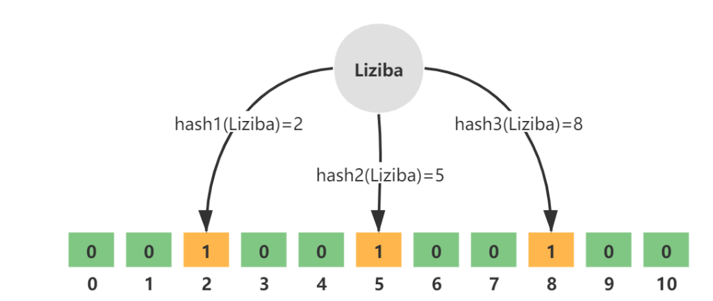
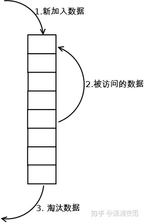
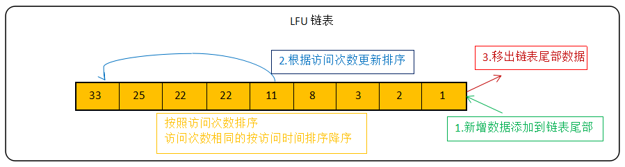

 ## 布隆过滤器：（解决缓存穿透问题）
 性质：可以得出某个值肯定不在集合中 或 可能在集和中
 ### 存储结构（位图）
 
通过k次无偏函数hash的形式设置位图为1

所以如果某个值判断不存在那么一定不存在
存在误判的情况：hash函数存在冲突
### 空间计算
创建需初始化预计元素个数n以及错误率f，布隆过滤器中有算法根据这两个参数会计算出二进制数组的大小l，以及无偏hash函数的个数k
错误率越低，位数组越大，内存消耗越大
错误率越低，无偏函数越多，计算耗时越长
### 如何解决缓存穿透问题
存数据时需把key同时存入布隆过滤器中，读取数据时判断key是否存在，存在时读取

## 缓存雪崩
缓存雪崩是指大量的应用请求无法在 Redis 缓存中进行处理，紧接着，应用将大量请求发送到数据库层，导致数据库层的压力激增
### 原因一：大量数据同时过期
 #### 预防
 1. 过期时间分散，避免同时过期
 2. 不设置过期时间

#### 容灾
1. 服务降级：是指发生缓存雪崩时，针对不同的数据采取不同的处理方式。
	1. 非核心数据直接返回默认值（错误、空）
	2. 核心数据则依旧读取

### 原因二：redis实例宕机
#### 预防
高可用
#### 容灾
1. 服务熔断
2. 限流

### 缓存穿透（使用布隆过滤器）
缓存穿透是指要访问的数据既不在 Redis 缓存中，也不在数据库中，导致请求在访问缓存时，发生缓存缺失，再去访问数据库时，发现数据库中也没有要访问的数据

## 问题
### 十亿热点数据，怎么处理
一、可以使用分片，把并发分到不同片
二、服务降级：非核心服务直接返回默认结果（空）
三、限流：部分数据进入，部分数据直接返回结果
## redis过期实现方案
1. 定时删除：消耗cpu
	1. 过期key存储：会将每个设置了过期时间的 key 放入到一个独立的字典中，以后会定期遍历这个字典来删除到期的 key
	2. 100ms的tick
		1. 随机选取20个key
		2. 删除过期的key
		3. 如果过期的 key 比率超过 1/4，那就重复步骤 1；
2. 惰性删除：读取的时候发现过期才删除，消耗内存
## redis淘汰机制
1. noeviction：当内存使用超过配置的时候会返回错误，不会驱逐任何键

2. allkeys-lru：加入键的时候，如果过限，首先通过LRU算法驱逐最久没有使用的键

3. volatile-lru：加入键的时候如果过限，首先从设置了过期时间的键集合中驱逐最久没有使用的键

4. allkeys-random：加入键的时候如果过限，从所有key随机删除

5. volatile-random：加入键的时候如果过限，从过期键的集合中随机驱逐

6. volatile-ttl：从配置了过期时间的键中驱逐马上就要过期的键

7. volatile-lfu：从所有配置了过期时间的键中驱逐使用频率最少的键

8. allkeys-lfu：从所有键中驱逐使用频率最少的键

淘汰策略算法：
1. 随机
2. LRU算法驱逐最久没有使用的键
   
3. LFU算法

