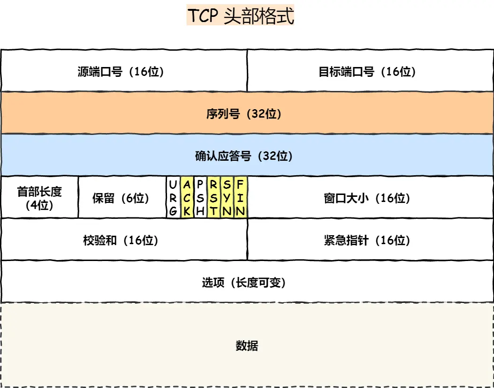
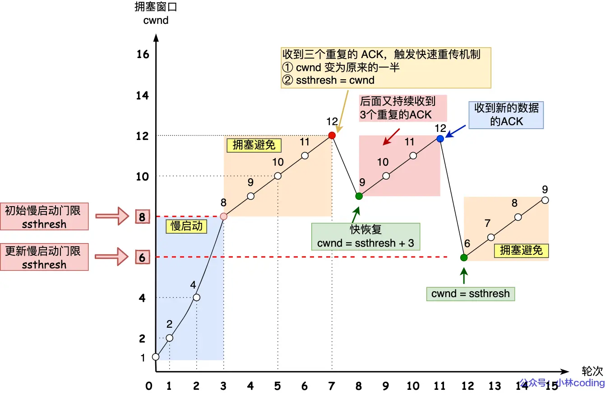

## TCP/IP协议
### 物理层
有物理地址，用交换机处理
### 网络层
使用IP（IPV4）协议
#### IP地址
总共32位，通过十进制看的话分为4个数字，每个占8位
分为两层，分别用网络层+主机号
网络号通过子网掩码确定

#### IP地址分类

### TCP协议
面向连接、可靠的、字节流
四元组确定连接

#### 协议头

ACK（1）：确认应答字段有效
SYN（1）：序列号有效
RST（1）：TCP连接出现异常，强制断开
FIN（1）：表示今后不需要发送数据，希望连接断开
#### 三次握手

#### 为什么需要三次连接？
1. 确定双方序列号（初始化双方版本号）
2. 防止历史连接带来的干扰（两次连接无法确定对方是否收到，连接就建立了），造成资源浪费
#### 第一次握手丢失
客户端会超时重传，有次数（默认五次）
等待时间分别为1秒、2秒、4秒、......

#### 第二次握手丢失
客户端会触发第一次握手丢失
服务端进行重传，次数（默认5次）

#### 第三次握手丢失
服务端会进行第二次握手丢失
第三次握手是客户端发送的ACK报文
因为ACK 报文是不会有重传的，当 ACK 丢失了，就由对方重传对应的报文（二次握手重传）

#### 什么是 SYN 攻击？如何避免 SYN 攻击？
TCP连接有两个队列
1. 半连接队列：连接未建立
2. 全连接队列：已经建立的连接

SYN 攻击方式最直接的表现就会把 TCP 半连接队列打满，这样当 TCP 半连接队列满了，后续再在收到 SYN 报文就会丢弃，导致客户端无法和服务端建立连接。
#### 解决方案
1. 扩大网卡数据包缓存池
2. 增大半连接队列
3. 开启net.ipv4.tcp_syncookies：开启 syncookies 功能就可以在不使用 SYN 半连接队列的情况下成功建立连接，相当于绕过了 SYN 半连接来建立连接（问题很大）
4. 缩小第一、二次握手重传次数

### 四次挥手

#### 为什么需要四次挥手
关闭连接时仅仅是客户端不需要发送数据，客户端还能接受数据
服务端收到客户端的 FIN 报文时，先回一个 ACK 应答报文，而服务端可能还有数据需要处理和发送，等服务端不再发送数据时，才发送 FIN 报文给客户端来表示同意现在关闭连接
#### 挥手丢失
挥手丢失跟握手丢失相似，默认次数为3次，3次后强制断开连接
 FIN_WAIT_2 状态是有时长限制的，如果 tcp_fin_timeout 时间内还是没能收到服务端的第三次挥手（FIN 报文），那么客户端就会断开连接
#### 为什么需要TIME_WAIT
1. 防止历史连接中的数据，被后面相同四元组的连接错误的接收(消费还在传输中的数据包)
2. 保证「被动关闭连接」的一方，能被正确的关闭（挥手ACK报文重传）
### 重传机制
### 超时重传
RTT：数据发送时刻到接收到确认的时刻的差值
RTO：超时重传时间，RTO时间由系统计算

### 快速重传

连续三次收到同个ACK（2），知道seq2没收到
问题：重传的时候，是重传一个，还是重传所有的问题
SACK 方法：在TCP头部加一个SACK字段，恢复收到的时哪个报文，避免重复发送
## 滑动窗口
窗口的实现实际上是操作系统开辟的一个缓存空间，发送方主机在等到确认应答返回之前，必须在缓冲区中保留已发送的数据。如果按期收到确认应答，此时数据就可以从缓存区清除

这个字段是接收端告诉发送端自己还有多少缓冲区可以接收数据。于是发送端就可以根据这个接收端的处理能力来发送数据，而不会导致接收端处理不过来。

所以，通常窗口的大小是由接收方的窗口大小来决定的。

### 慢重启

成二次方增加
当大于等于慢启动门限（ssthresh）使用拥塞避免算法
### 拥塞避免算法

### 拥塞发生
#### 超时重传
ssthresh 设为 cwnd/2，
cwnd 重置为 1 （是恢复为 cwnd 初始化值，我这里假定 cwnd 初始化值 1，linux是10）
#### 快速重传
cwnd = cwnd/2 ，也就是设置为原来的一半;
ssthresh = cwnd
进入快速恢复
#### 快速恢复
1. 拥塞窗口 cwnd = ssthresh + 3 （ 3 的意思是确认有 3 个数据包被收到了）；
2. 重传丢失的数据包；
3. 如果再收到重复的 ACK，那么 cwnd 增加 1；
4. 如果收到新数据的 ACK 后，把 cwnd 设置为第一步中的 ssthresh 的值，原因是该 ACK 确认了新的数据，说明从 duplicated ACK 时的数据都已收到，该恢复过程已经结束，可以回到恢复之前的状态了，也即再次进入拥塞避免状态；

为什么有第四步：
在快速恢复的过程中，首先 ssthresh = cwnd/2，然后 cwnd = ssthresh + 3，表示网络可能出现了阻塞，所以需要减小 cwnd 以避免，加 3 代表快速重传时已经确认接收到了 3 个重复的数据包；
随后继续重传丢失的数据包，如果再收到重复的 ACK，那么 cwnd 增加 1。加 1 代表每个收到的重复的 ACK 包，都已经离开了网络。这个过程的目的是尽快将丢失的数据包发给目标。
如果收到新数据的 ACK 后，把 cwnd 设置为第一步中的 ssthresh 的值，恢复过程结束

## HTTP
超文本传协议
### 状态码

### 常见字段
Host 字段：客户端发送请求时，用来指定服务器的域名
Content-Length 字段：服务器在返回数据时，会有 Content-Length 字段，表明本次回应的数据长度
Connection 字段：字段最常用于客户端要求服务器使用「HTTP 长连接」机制，以便其他请求复用
Content-Type：字段用于服务器回应时，告诉客户端，本次数据是什么格式
Content-Encoding：段说明数据的压缩方法。表示服务器返回的数据使用了什么压缩格式

### GET 与 POST
#### GET 和 POST 有什么区别
GET：获取资源，GET 方法就是安全且幂等的
POST：修改资源，不是幂等的
## HTTP 缓存技术
### 强制缓存
强缓存指的是只要浏览器判断缓存没有过期，则直接使用浏览器的本地缓存，决定是否使用缓存的主动性在于浏览器这边
强缓存是利用下面这两个 HTTP 响应头部（Response Header）字段实现的，它们都用来表示资源在客户端缓存的有效期：

Cache-Control， 是一个相对时间；
Expires，是一个绝对时间；
### 协商缓存
当我们在浏览器使用开发者工具的时候，你可能会看到过某些请求的响应码是 304，这个是告诉浏览器可以使用本地缓存的资源，通常这种通过服务端告知客户端是否可以使用缓存的方式被称为协商缓存
协商缓存可以基于两种头部来实现
1. 请求头部中的 If-Modified-Since 字段与响应头部中的 Last-Modified 字段实现
	1. 响应头部中的 Last-Modified：标示这个响应资源的最后修改时间
	2. 当资源过期了，发现响应头中具有 Last-Modified 声明，则再次发起请求的时候带上 Last-Modified 的时间，服务器收到请求后发现有 If-Modified-Since 则与被请求资源的最后修改时间进行对比（Last-Modified），如果最后修改时间较新（大），说明资源又被改过，则返回最新资源，HTTP 200 OK；如果最后修改时间较旧（小），说明资源无新修改，响应 HTTP 304 走缓存
2. 请求头部中的 If-None-Match 字段与响应头部中的 ETag 字段
	1. 响应头部中 Etag：唯一标识响应资源
	2. 请求头部中的 If-None-Match：当资源过期时，浏览器发现响应头里有 Etag，则再次向服务器发起请求时，会将请求头 If-None-Match 值设置为 Etag 的值。服务器收到请求后进行比对，如果资源没有变化返回 304，如果资源变化了返回 200
