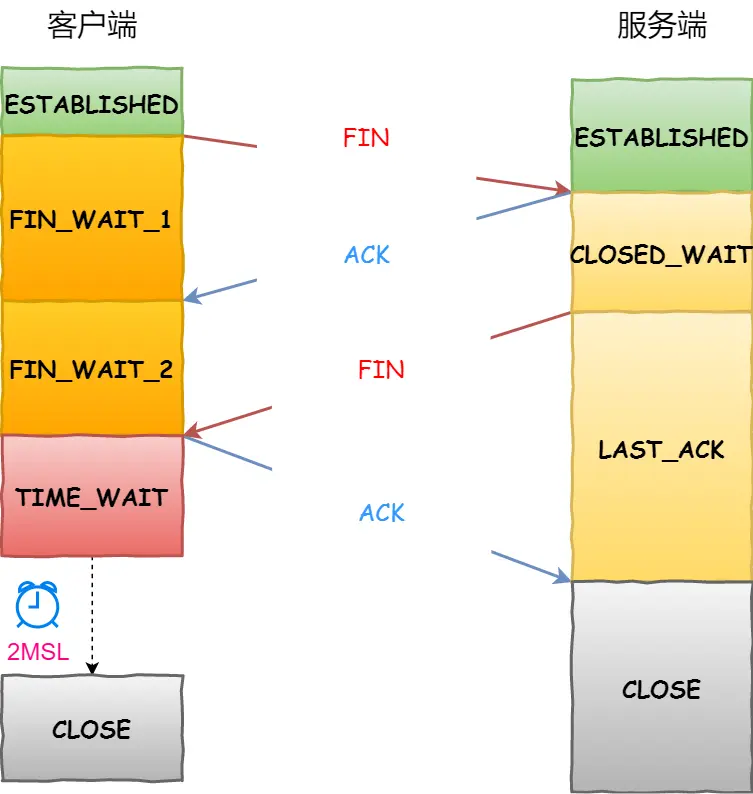

## TCP/IP协议
### 物理层
有物理地址，用交换机处理
### 网络层
使用IP（IPV4）协议
#### IP地址
总共32位，通过十进制看的话分为4个数字，每个占8位
分为两层，分别用网络层+主机号
网络号通过子网掩码确定

#### IP地址分类

### TCP协议
面向连接、可靠的、字节流
四元组确定连接

#### 协议头

ACK（1）：确认应答字段有效
SYN（1）：序列号有效
RST（1）：TCP连接出现异常，强制断开
FIN（1）：表示今后不需要发送数据，希望连接断开
#### 三次握手

#### 为什么需要三次连接？
1. 确定双方序列号（初始化双方版本号）
2. 防止历史连接带来的干扰（两次连接无法确定对方是否收到，连接就建立了），造成资源浪费
#### 第一次握手丢失
客户端会超时重传，有次数（默认五次）
等待时间分别为1秒、2秒、4秒、......

#### 第二次握手丢失
客户端会触发第一次握手丢失
服务端进行重传，次数（默认5次）

#### 第三次握手丢失
服务端会进行第二次握手丢失
第三次握手是客户端发送的ACK报文
因为ACK 报文是不会有重传的，当 ACK 丢失了，就由对方重传对应的报文（二次握手重传）

#### 什么是 SYN 攻击？如何避免 SYN 攻击？
TCP连接有两个队列
1. 半连接队列：连接未建立
2. 全连接队列：已经建立的连接

SYN 攻击方式最直接的表现就会把 TCP 半连接队列打满，这样当 TCP 半连接队列满了，后续再在收到 SYN 报文就会丢弃，导致客户端无法和服务端建立连接。
#### 解决方案
1. 扩大网卡数据包缓存池
2. 增大半连接队列
3. 开启net.ipv4.tcp_syncookies：开启 syncookies 功能就可以在不使用 SYN 半连接队列的情况下成功建立连接，相当于绕过了 SYN 半连接来建立连接（问题很大）
4. 缩小第一、二次握手重传次数

### 四次挥手

#### 为什么需要四次挥手
关闭连接时仅仅是客户端不需要发送数据，客户端还能接受数据
服务端收到客户端的 FIN 报文时，先回一个 ACK 应答报文，而服务端可能还有数据需要处理和发送，等服务端不再发送数据时，才发送 FIN 报文给客户端来表示同意现在关闭连接
#### 挥手丢失
挥手丢失跟握手丢失相似，默认次数为3次，3次后强制断开连接
 FIN_WAIT_2 状态是有时长限制的，如果 tcp_fin_timeout 时间内还是没能收到服务端的第三次挥手（FIN 报文），那么客户端就会断开连接
#### 为什么需要TIME_WAIT
1. 防止历史连接中的数据，被后面相同四元组的连接错误的接收(消费还在传输中的数据包)
2. 保证「被动关闭连接」的一方，能被正确的关闭（挥手ACK报文重传）
### 重传机制
### 超时重传
RTT：数据发送时刻到接收到确认的时刻的差值
RTO：超时重传时间，RTO时间由系统计算

### 快速重传

连续三次收到同个ACK（2），知道seq2没收到
问题：重传的时候，是重传一个，还是重传所有的问题
SACK 方法：在TCP头部加一个SACK字段，恢复收到的时哪个报文，避免重复发送
## 滑动窗口
